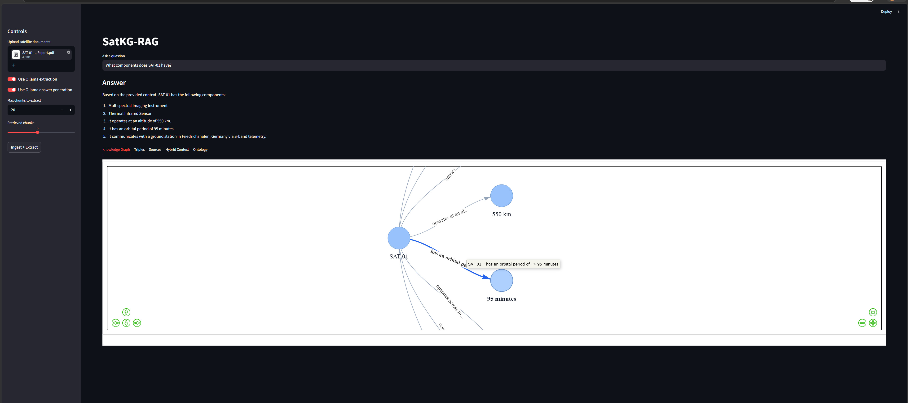

<div align="center">

# 🛰️ SatKG-RAG

### Local-first satellite knowledge graph and GraphRAG implementation

[](https://www.python.org/)
[](https://streamlit.io/)
[](https://www.trychroma.com/)
[](https://networkx.org/)
[](https://rdflib.readthedocs.io/)
[](https://spacy.io/)

Turns technical satellite documents into semantic chunks, RDF/OWL triples, an interactive knowledge graph, and grounded answers using hybrid Vector + Graph retrieval.

[Quick Start](#-quick-start) • [How It Works](#-how-it-works) • [Architecture](#-architecture) • [Project Structure](#-project-structure)

</div>

---

## ✨ What it does

| Stage | Description |
| --- | --- |
| **Ingest** | Processes PDF, TXT, and HTML satellite documents with token-aware chunking |
| **Extract** | Identifies entities (Satellites, Sensors, Anomalies) and extracts triples using fast local rules |
| **Model** | Materializes an RDF/OWL ontology and builds a NetworkX knowledge graph |
| **Retrieve** | Combines semantic vector search (ChromaDB) with graph-expanded entity context |
| **Answer** | Generates grounded answers with clear source attribution and graph visualization |

---

## 🚀 Key Features

- **Ontology-First Design**: Defines formal satellite-domain concepts and relationships (e.g., `thermal anomaly causedBy battery subsystem`).
- **Hybrid GraphRAG**: Merges semantic chunk retrieval with graph fact expansion for superior context.
- **Explainable AI**: Side-by-side view of retrieved chunks, graph triples, ontology Turtle, and the final answer.
- **Local-First Stack**: Zero-cost architecture; runs fully offline with optional Ollama support for advanced extraction.
- **Interactive Visualization**: Explore the knowledge graph with readable node spacing, hover details, and triple tables.

---

## 🖼️ Application Interface



---

## 🏗️ Architecture

```text
Documents
   |
   v
Ingestion + Token Chunking (PyMuPDF, LangChain, tiktoken)
   |
   v
Entity + Relation Extraction (spaCy / EntityRuler, Ollama optional)
   |
   v
Ontology + Knowledge Graph (rdflib OWL/RDF, NetworkX)
   |
   +----------------------+----------------------+
   |                                             |
   v                                             v
Chroma Vector Store                        Graph Traversal
(sentence-transformers)             (entity neighborhood expansion)
   |                                             |
   +----------------------+----------------------+
                          v
                    Hybrid GraphRAG Fusion
                          |
                          v
                   Streamlit Demo UI
```

---

## 🛠️ Tech Stack

| Component | Technology | Why? |
|-----------|------------|------|
| **UI** | Streamlit | Rapid development of interactive data applications |
| **Graph Visualization** | PyVis | Interactive, browser-based graph rendering |
| **Vector DB** | ChromaDB | Lightweight, local, and easy to integrate |
| **Ontology Engineering** | rdflib / Owlready2 | Industry standard for RDF/OWL and semantic web |
| **NLP / NER** | spaCy | Fast, reliable entity extraction with custom rule support |
| **Graph Logic** | NetworkX | Robust library for complex network analysis and traversal |
| **Embeddings** | sentence-transformers | State-of-the-art local semantic embeddings |

---

## 🚀 Quick Start

### 1) Setup Environment

```powershell
# Clone and enter directory
cd SatKG-RAG

# Create and activate virtual environment
python -m venv .venv
.\.venv\Scripts\Activate.ps1

# Install dependencies
pip install -r requirements.txt
# OR for development:
pip install -e ".[dev]"
```

### 2) (Optional) Download NLP Models
If you want stronger general NER beyond the built-in satellite rules:
```powershell
python -m spacy download en_core_web_sm
```

### 3) Run the Application
```powershell
streamlit run src/satkg_rag/ui_app.py --server.fileWatcherType none
```

---

## 💡 Recommended Demo Flow

1. **Upload**: Drop a satellite-related PDF or TXT file into the uploader.
2. **Configure**: Leave `Use Ollama extraction` off for a fast demo; set `Max chunks` to `10`.
3. **Extract**: Click `Ingest + Extract` and watch the graph materialize.
4. **Inspect**: Explore the `Knowledge Graph`, `Triples`, and `Ontology` tabs.
5. **Query**: Ask: *"Explain the thermal anomaly in SAT-102"* or *"What relationships mention battery temperature?"*

---

## 📂 Project Structure

```text
src/satkg_rag/
  ├── agentic.py       # Rule-based routing for vector/graph tools
  ├── config.py        # Pipeline configuration
  ├── extraction.py    # Entity and triple extraction logic
  ├── graph_store.py   # NetworkX storage and traversal
  ├── ingestion.py     # Document loading and chunking
  ├── models.py        # Pydantic data models
  ├── ontology.py      # RDF/OWL ontology management
  ├── pipeline.py      # End-to-end GraphRAG pipeline
  ├── retrieval.py     # ChromaDB retrieval and context fusion
  └── ui_app.py        # Streamlit application entry point

tests/
  └── test_core_layers.py
```

---

## ✅ Testing

```powershell
$env:PYTHONPATH="src"
python -m pytest -q
```

---

## 🎯 Positioning

This project serves as a portfolio-grade reference implementation for aerospace AI roles, demonstrating mastery in:
- **Formal Ontology Modeling**
- **Document-to-Graph Extraction Pipelines**
- **Graph-Aware Retrieval-Augmented Generation**
- **Local LLM Integration & Agentic Routing**
